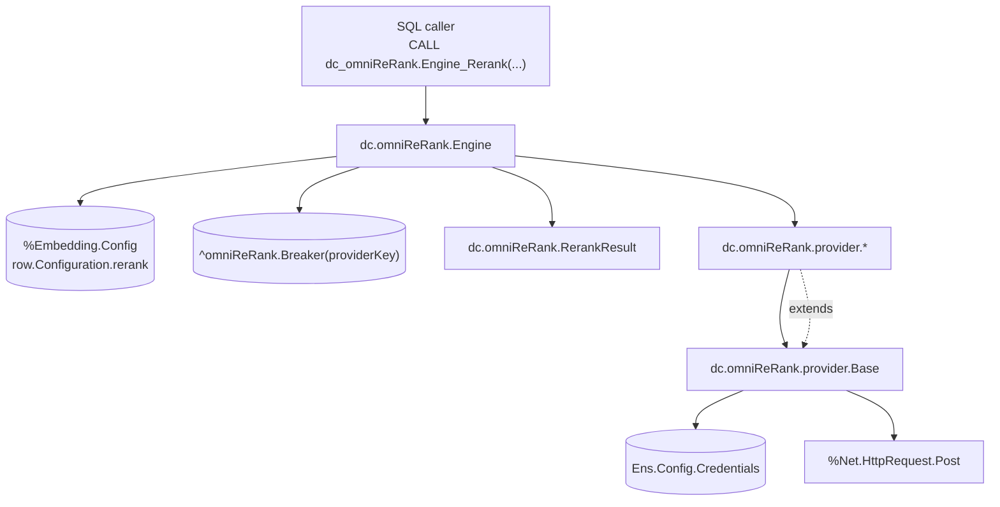
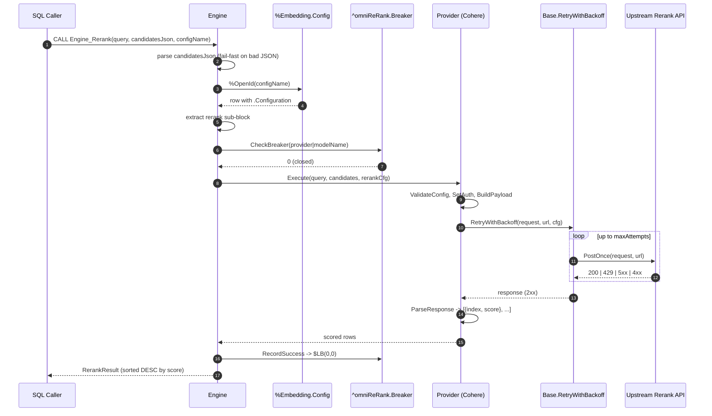
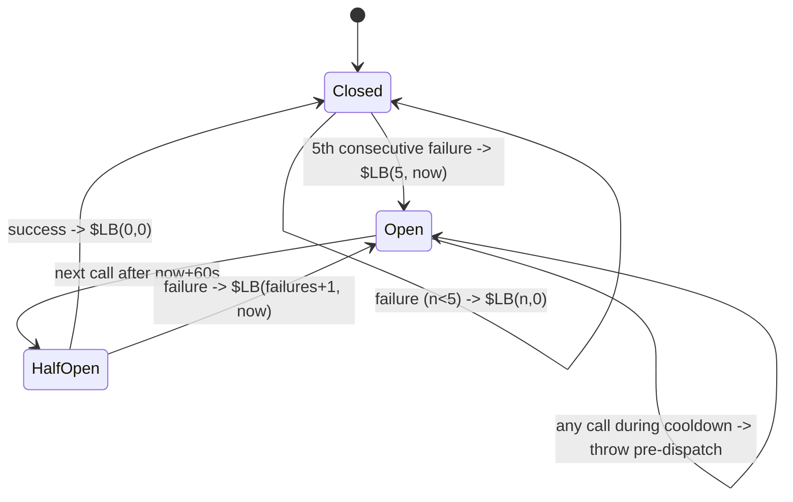

# Architecture Spine — dc.omniReRank

## Design Paradigm

**Template Method** on `dc.omniReRank.provider.Base` for the per-provider variance; **Mediator** on `dc.omniReRank.Engine` for the cross-cutting concerns (SQL surface, configuration load, provider resolution, circuit breaker). The two patterns compose: the Engine chooses and calls one Provider per request; the Provider follows a fixed hook sequence inherited from Base. There is no dependency injection framework, no service locator, and no runtime discovery — every seam is either a class extension point (subclass Base) or an explicit process-private global (test-only).

Namespace layout mirrors the paradigm one-to-one:

| Package | Role |
| --- | --- |
| `dc.omniReRank` | Engine + result-set contract (Mediator layer). |
| `dc.omniReRank.provider` | `Base` + concrete Providers (Template Method layer). |
| `dc.omniReRank.unittests` | Tests + mocks. Never referenced from production paths. |

## Invariants & Rules



**Dependency-direction rule (enforceable):** an arrow points *from* the depender *to* the dependency. No arrows the diagram omits. In particular: Providers never see `Engine`, `RerankResult`, or `^omniReRank.Breaker`; the Engine never issues HTTP directly; `RerankResult` reads no globals.

### AD-1 — `Base.Execute` is a Template Method, virtual (not `[Final]`) [ADOPTED]

- **Binds:** FR-4, FR-5, FR-6; every class under `dc.omniReRank.provider.*`.
- **Prevents:** Providers reimplementing the request lifecycle in five different ways, and simultaneously prevents locking out providers whose auth scheme (e.g. AWS SigV4) must run *after* the body is written.
- **Rule:** `Base.Execute` sequences `ValidateConfig → SetAuth → GetRerankUrl → BuildPayload → RetryWithBackoff(PostOnce) → ParseResponse`. Providers implement the five abstract hooks. A Provider that overrides `Execute` must document the ordering constraint that forces the override in a class comment; no other reason justifies the override.

### AD-2 — Engine mediates every SQL call; Providers never see the SQL surface [ADOPTED]

- **Binds:** FR-1, FR-2, FR-3, FR-8; `dc.omniReRank.Engine`, `dc.omniReRank.provider.*`.
- **Prevents:** A Provider adding SQL entry points (or reading `%Embedding.Config`, or touching `^omniReRank.Breaker`) — which would make swapping providers a caller-visible change.
- **Rule:** The only `[ SqlProc ]` in `dc.omniReRank.*` is `Engine.Rerank(query, candidatesJson, configName)`. Providers accept `(query, candidates, rerankCfg)` where `rerankCfg` is the already-extracted sub-block; they receive no config name, no breaker handle, and no SQL context.

### AD-3 — Rerank configuration lives at `%Embedding.Config.Configuration.rerank` [ADOPTED]

- **Binds:** FR-2; `dc.omniReRank.Engine`.
- **Prevents:** Two competing config stores (embedding vs. rerank) drifting; also prevents Providers from persisting their own config side-tables.
- **Rule:** The Engine loads `%Embedding.Config` by `configName`, parses `Configuration` as JSON, and reads the `.rerank` sub-object. Absent row → throw naming the store checked. Present row without `rerank` sub-block → throw naming the row and stating the required `{provider, modelName, apiKey}` minimum. No other persistent class stores rerank config in v1.

### AD-4 — Credentials are always resolved by name from `Ens.Config.Credentials` [ADOPTED]

- **Binds:** FR-9; `Base.ResolveApiKey`, every Provider's `SetAuth`, every Provider's `ValidateConfig`.
- **Prevents:** Raw secrets landing in `%Embedding.Config` JSON, error messages, backup dumps, or log lines.
- **Rule:** `rerank.apiKey` is a credential *name*. Only `Base.ResolveApiKey` reads `Ens.Config.Credentials.Password`; its return value flows to exactly one place — a Provider's `SetAuth` write onto `%Net.HttpRequest.Authorization`. No `%Status` message, no exception `DisplayString()`, and no logging call inside `dc.omniReRank.*` may contain the resolved value. Credential *names* are public metadata and may appear in status hints.

### AD-5 — Circuit breaker persists at `^omniReRank.Breaker` keyed by `provider|modelName` [ADOPTED]

- **Binds:** FR-8; `dc.omniReRank.Engine`.
- **Prevents:** A broken upstream being retried request-by-request across processes; also prevents per-process breaker state that resets on job restart.
- **Rule:** State layout is `^omniReRank.Breaker(providerKey) = $LB(failures, openedAtSeconds)`. `providerKey = provider _ "|" _ modelName` (no `apiBase` — deferred until a provider actually reads it). `FAILURETHRESHOLD = 5`, `COOLDOWNSECONDS = 60`. Open breaker throws with `"circuit breaker open"` *before* Provider dispatch (no HTTP). Success writes `$LB(0, 0)` explicitly. Half-open = the next call after `openedAt + COOLDOWNSECONDS`; its outcome resets or re-opens.

### AD-6 — Retries only on 429 and 5xx; honor numeric `Retry-After`; fast-fail every other 4xx [ADOPTED]

- **Binds:** FR-7; `Base.RetryWithBackoff`.
- **Prevents:** Retrying a hopeless 401/404 into a customer wait; also prevents ignoring a provider's explicit backoff signal.
- **Rule:** Defaults `maxAttempts=3, baseDelayMs=500, maxDelayMs=8000, honorRetryAfter=1` — all overridable at `rerank.retry.*`. Backoff `min(baseDelayMs * 2^(attempt-1) + rand(baseDelayMs), maxDelayMs)`. A numeric `Retry-After` (when honored) supersedes the computed delay. Non-429 4xx statuses fast-fail with a status hint that names the credential *name* only.

### AD-7 — Provider resolution is explicit; no `modelName`-prefix inference

- **Binds:** FR-3, FR-5; `dc.omniReRank.Engine.ResolveProvider`.
- **Prevents:** Silent mis-routing when a shared model naming convention emerges across vendors (e.g. two vendors both shipping `rerank-v3-*`), and prevents "quiet magic" surprises for operators reading a config.
- **Rule:** `rerank.provider` is required and matched case-insensitively against a known set (`cohere` shipped; `voyage`, `jina`, `ollama` v1 targets). Unknown or missing value throws with the current valid list.

### AD-8 — `RerankResult` is a `%SQL.CustomResultSet` with a fixed column contract

- **Binds:** FR-1; `dc.omniReRank.RerankResult`, `dc.omniReRank.Engine.Rerank`.
- **Prevents:** Downstream callers depending on ad-hoc column shapes; prevents "just add a column" changes that break every joining query.
- **Rule:** Columns are exactly `originalIndex INT`, `candidate VARCHAR`, `score DOUBLE` in that order. Rows are sorted `score DESC`; ties preserve provider return order. `originalIndex` is 0-based into the caller's `candidatesJson`. Initializer is `%New()` + `SetRows(rows)` — do not add an `%OnNew(rows)` (it collides with the Final `%OnNew` in the parent on this IRIS build).

### AD-9 — Never merge scores across Providers in one result set

- **Binds:** FR-8, §5 Non-Goals, future v2 fallback; `dc.omniReRank.Engine`.
- **Prevents:** A future fallback that returns a blended top-K from two providers whose score scales are incomparable — a silent lie to the caller.
- **Rule:** Exactly one Provider produces any single `RerankResult`. A v2 fallback loop may retry one provider at a time after the primary throws, but the returned result set must originate from a single Provider call. Any code path that would concatenate `results[]` from two Providers is prohibited.

### AD-10 — Test seams are process-private globals with the `^||omniReRank*` prefix

- **Binds:** all test code under `dc.omniReRank.unittests.*`; `Base.ResolveApiKey`, `Base.PostOnce`, `Engine.ResolveProvider`.
- **Prevents:** Test-only wiring leaking into production (a non-private global would survive process end and be observable via SQL), and prevents ad-hoc test hooks scattering across the codebase.
- **Rule:** Three sanctioned seams, all `^||`-scoped:
  - `^||omniReRankCredential(name)` — overrides `Base.ResolveApiKey`.
  - `^||omniReRankMockPostQueue(N)` — FIFO of `$LB(status, headersString, body)` triples consumed by test subclasses of `Base` that override `PostOnce`.
  - `^||omniReRankProviderOverride(provider)` — overrides `Engine.ResolveProvider` mapping.
  Adding a new seam requires a new AD.

## Consistency Conventions

| Concern | Convention |
| --- | --- |
| Naming — packages | `dc.omniReRank` (root), `dc.omniReRank.provider.<VendorPascalCase>` (e.g. `Cohere`, `Voyage`, `Jina`, `Ollama`). |
| Naming — Engine SQL surface | `Engine.<Verb>` as `[ SqlProc ]`; SQL call form `CALL dc_omniReRank.Engine_<Verb>(...)`. Only `Rerank` in v1. |
| Naming — globals | Persistent: `^omniReRank.<Concern>` (dot-namespaced, e.g. `^omniReRank.Breaker`). Test-only: `^||omniReRank<Concern>` (process-private, no dot). |
| Config JSON keys | `camelCase` at every depth: `modelName`, `apiKey`, `topN`, `httpTimeout`, `sslConfig`, `apiBase`, `retry.maxAttempts`, `retry.baseDelayMs`, `retry.maxDelayMs`, `retry.honorRetryAfter`. |
| Error shape | Every thrown `%Status` message is prefixed `dc.omniReRank.<Class>.<Method>: <what failed>`. Hint clauses (from `StatusHint` / `TransportHint`) may follow. Credential names may appear; secrets may not. |
| Response parsing failure | Provider `ParseResponse` throws with the raw body dumped in the error (bounded read, first 300 bytes for HTTP error paths). Never returns an empty array or null on parse failure. |
| Test hooks | Every seam listed in AD-10 is scoped to `^||...` (process-private). Adding a persistent global for a test hook is a review-blocker. |
| Compilation unit | One `.cls` per class, mirroring package path under `src/`. `module.xml` declares one resource `dc.omniReRank.PKG` and one `UnitTest Package="dc.omniReRank.unittests"`. |

## Stack

| Name | Version |
| --- | --- |
| InterSystems IRIS | 2026.x (min build TBD — PRD §8 Q3) |
| ObjectScript | shipped with target IRIS |
| IPM (InterSystems Package Manager) | current |
| `iris-agentic-dev` (dev/test harness) | current on PATH |
| Cohere Rerank API | v2 (`/v2/rerank`) |
| Voyage Rerank API | v1 (target for v1 shipment; verify at implementation time) |
| Jina Rerank API | v2 (target for v1 shipment; verify at implementation time) |
| Ollama Rerank API | `/api/rerank` on Ollama ≥ 0.6.0 (PRD §8 Q2 — verify at implementation time) |

## Structural Seed

**Request lifecycle** (happy path, single provider):



**Circuit breaker states**:



**Source tree** (spine-owned shape only; the code owns detail):

```text
omniRerank/
  src/dc/omniReRank/
    Engine.cls               # Mediator: SQL surface, config load, breaker, dispatch
    RerankResult.cls         # %SQL.CustomResultSet with fixed column contract
    provider/
      Base.cls               # Template Method + retry + credential resolution
      Cohere.cls             # shipped
      Voyage.cls             # v1 target
      Jina.cls               # v1 target
      Ollama.cls             # v1 target — authless path
  tests/dc/omniReRank/unittests/
    TestCohere.cls           # shipped
    TestResilience.cls       # shipped
    MockProvider.cls         # trivial mock — Engine dispatch tests
    MockHttpProvider.cls     # PostOnce override — Base retry/HTTP path tests
  module.xml                 # single Resource dc.omniReRank.PKG
```

## Capability → Architecture Map

| Capability (PRD FR) | Lives in | Governed by |
| --- | --- | --- |
| FR-1 One-call reranking from SQL | `Engine.Rerank` `[ SqlProc ]` + `RerankResult` | AD-2, AD-8 |
| FR-2 Config in `%Embedding.Config` | `Engine.Rerank` config-load block | AD-3 |
| FR-3 Fail-fast argument validation | `Engine.Rerank` guards + `Base.ValidateConfig` hook | AD-2, AD-7 |
| FR-4 Cohere provider | `provider/Cohere.cls` | AD-1 |
| FR-5 Voyage, Jina, Ollama providers | `provider/Voyage.cls`, `provider/Jina.cls`, `provider/Ollama.cls` | AD-1, AD-4 (SaaS), AD-7 |
| FR-6 `Base.Execute` remains virtual | `provider/Base.cls` header | AD-1 |
| FR-7 Retry with backoff | `Base.RetryWithBackoff` + `ComputeBackoffDelay` | AD-6 |
| FR-8 Circuit breaker | `Engine.CheckBreaker`/`RecordSuccess`/`RecordFailure`/`NowSeconds` on `^omniReRank.Breaker` | AD-5, AD-9 |
| FR-9 Credential safety | `Base.ResolveApiKey` + per-provider `SetAuth` | AD-4 |
| Testing | `unittests/*` + three test seams | AD-10 |

## Deferred

- **Provider fallbacks (v2).** The Engine's `provider` slot could accept a fallback list; each fallback would run one-at-a-time after the primary throws, subject to AD-9 (no score-merging) and an as-yet-undefined compatibility check. See PRD §8 Q1.
- **Metrics / telemetry export.** Per-provider latency histograms and breaker-open counters — deferred to v2 per PRD §6.2. The `^omniReRank.Breaker` global is already introspectable; adding a `%SQL.CustomResultSet` `Engine.Stats()` view is the natural v2 shape.
- **Response caching.** Deferred by design — cache-key correctness (query + candidates + model + provider version) belongs to the caller for now.
- **`apiBase` in the breaker key.** Reserved for the point a Provider actually reads `apiBase`; today no Provider does, so widening the key would only reduce discrimination.
- **REST surface.** Explicitly a Non-Goal (PRD §5); a REST wrapper would be a separate service, not part of this spine.
- **Score normalization column.** `normalizedScore DOUBLE` column on `RerankResult` — deferred until a caller asks (PRD §8 Q5).
- **Public-naming casing.** `dc.omniReRank` vs. `dc.omniRerank` casing decision deferred to v1 release cut (PRD §8 Q4).
